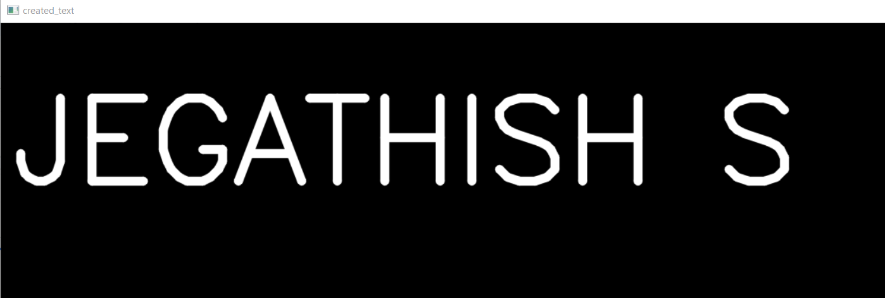
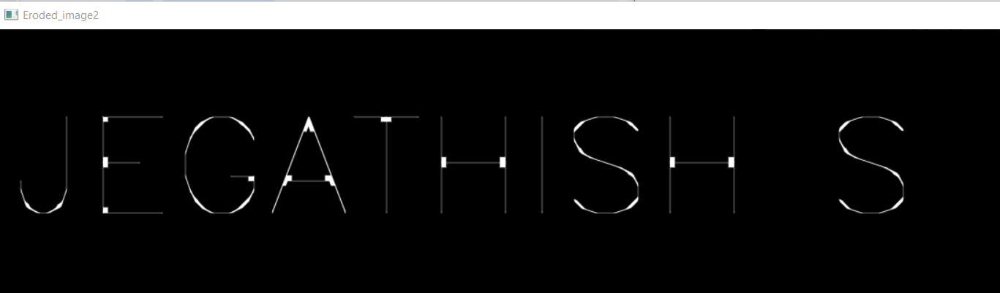
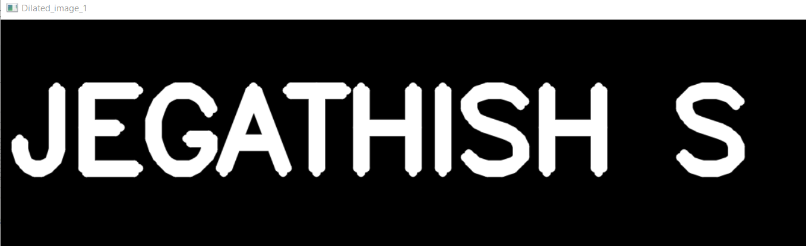

# EROSION-AND-DILATION

## Aim
To implement Erosion and Dilation using Python and OpenCV.
## Software Required
1. Anaconda - Python 3.7
2. OpenCV
## Algorithm:
### Step1:
Import necessary packages

### Step2:
Create a empty window and add text in it

### Step3:
create a structuring element


### Step4:
Do the operation


### Step5:
Show the Output Image
 
## Program:

``` 
# Import the necessary packages
import cv2
import numpy as np

# Create the Text using cv2.putText
img= np.zeros((350,1400),dtype ='uint8')
font = cv2.FONT_HERSHEY_SIMPLEX
cv2.putText(img,'JEGATHISH S',(15,200),font,5,(255),10,cv2.LINE_AA)
cv2.imshow('created_text',img)
cv2.waitKey(0)
cv2.destroyAllWindows()


# Create the structuring element
erode1= np.ones((5,5),np.uint8)
erode2 = cv2.getStructuringElement(cv2.MORPH_CROSS,(12,12))


dilate1= np.ones((5,5),np.uint8)
dilate2 = cv2.getStructuringElement(cv2.MORPH_CROSS,(12,12))

# Erode the image
image_erode2 = cv2.erode(img,erode2)
cv2.imshow('Eroded_image2',image_erode2)
cv2.waitKey(0)
cv2.destroyAllWindows()


# Dilate the image
image_dilate2 = cv2.dilate(img,dilate2)
cv2.imshow('Dilated_image_1',image_dilate2)
cv2.waitKey(0)
cv2.destroyAllWindows()


```
## Output:

### Display the input Image


### Display the Eroded Image
<
### Display the Dilated Image


## Result
Thus the generated text image is eroded and dilated using python and OpenCV.
